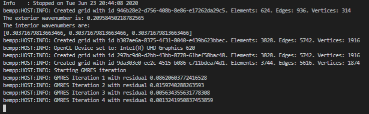
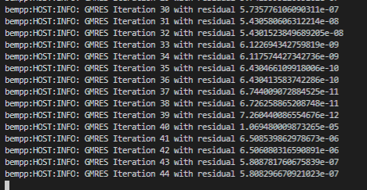

<https://scattport.org/index.php/light-scattering-software/method-of-moments>

## Mixed Neumann-Dirichlet Probrem

With Bempp,
it is possible to define operators only on segments of a given domain.
This makes it possible to solve mixed Neumann-Dirichlet problems.
In this tutorial,
we solve the Laplace equation inside the unit cube with unit Dirichlet boundary conditions
on two sides and unit Neumann boundary conditions on the other four sides.

$$\begin{aligned}
\left[\mathsf{V}t\right] (\mathbf{x}) - \left[\mathsf{K}u\right] (\mathbf{x}) &= \left[\tfrac{1}{2}\mathsf{Id} + \mathsf{K}\right]g_D(\mathbf{x}) - \mathsf{V}g_N(\mathbf{x}),\quad \mathbf{x}\in\Gamma_D\\
\left[\mathsf{W}u\right] (\mathbf{x}) + \left[\mathsf{K}'t\right] (\mathbf{x}) &=\left[\tfrac{1}{2}\mathsf{Id} - \mathsf{K}'\right]g_N(\mathbf{x}) - \mathsf{W}g_D(\mathbf{x}),\quad \mathbf{x}\in\Gamma_N
\end{aligned}$$

The difficulty in the implementation is
the definition of the discrete function spaces and the treatment of degrees of freedom (dofs)
that lie on the interface between $\Gamma_N$ and $\Gamma_D$.
In the following,
we will go through the implementation and point out
how to correctly define all spaces involved.

## Scattering from a sphere using a combined direct formulation

In this tutorial, we will solve the problem of scattering from the unit sphere $\Omega$ using a combined integral formulation and an incident wave defined by

$$u^{\text{inc}}(\mathbf x) = \mathrm{e}^{\mathrm{i} k x}.$$

where $\mathbf x = (x, y, z)$.

The PDE is given by the <a href='/tag/Helmholtz'>Helmholtz equation</a>:

$$\Delta u + k^2 u = 0, \quad \text{ in } \mathbb{R}^3 \backslash \Omega,$$

where $u=u^\text{s}+u^\text{inc}$ is the total acoustic field and $u^\text{s}$ satisfies the Sommerfeld radiation condition

$$\frac{\partial u^\text{s}}{\partial r}-\mathrm{i}ku^\text{s}=o(r^{-1})$$

for $r:=|\mathbf{x}|\rightarrow\infty$.
From Green's representation formula, one can derive that

$$u(\mathbf x) = u^\text{inc}-\int_{\Gamma}g(\mathbf x,\mathbf y)\frac{\partial u}{\partial\nu}(\mathbf y)\mathrm{d}\mathbf{y}.$$

Here, $g(\mathbf x, \mathbf y)$ is the acoustic Green's function given by

$$g(\mathbf x, \mathbf y):=\frac{\mathrm{e}^{\mathrm{i} k |\mathbf{x}-\mathbf{y}|}}{4 \pi |\mathbf{x}-\mathbf{y}|}.$$

The problem has therefore been reduced to computing the normal derivative $u_\nu:=\frac{\partial u}{\partial\nu}$ on the boundary $\Gamma$. This is achieved using the following boundary integral equation formulation.

$$(\tfrac12\mathsf{Id} + \mathsf{K}' - \mathrm{i} \eta \mathsf{V}) u_\nu(\mathbf{x}) = \frac{\partial u^{\text{inc}}}{\partial \nu}(\mathbf{x}) - \mathrm{i} \eta u^{\text{inc}}(\mathbf{x}), \quad \mathbf{x} \in \Gamma.$$

where $\mathsf{Id}$, $\mathsf{K}'$ and $\mathsf{V}$ are identity, adjoint double layer and single layer <a href='https://bempp.com/2017/07/11/available_operators/'>boundary operators</a>. More details of the derivation of this formulation and its properties can be found in the article <a href='http://journals.cambridge.org/action/displayAbstract?fromPage=online&aid=8539370&fileId=S0962492912000037' target='new'>Chandler-Wilde <em>et al</em> (2012)</a>.

lace problem with Dirichlet boundary conditions

## Solving a Laplace problem with Dirichlet boundary conditions

`laplace_interior_dirichlet.py`

frequency = 10MHz

In this tutorial, we will solve a simple Laplace problem inside the unit sphere with Dirichlet boundary conditions. Let $\Omega$ be the unit sphere with boundary $\Gamma$. Let $\nu$ be the outward pointing normal on $\Gamma$. The PDE and boundary conditions are given by

$$\begin{align}
\Delta u &= 0&&\text{in }\Omega,\\
u &= f&&\text{on }\Gamma.
\end{align}$$

The boundary data is a source $\hat{u}$ located at the point $(0.9,0,0)$.

$$\hat{u}(\mathbf x)=\frac{1}{4\pi\sqrt{(x-0.9)^2+y^2+z^2}}.$$

For this example, we will use a direct integral equation of the first kind. Let

$$g(\mathbf x,\mathbf y) = \frac{1}{4\pi |\mathbf x-\mathbf y|}$$

be the Green's function for Laplace in three dimensions. From Green's representation theorem, it follows that every harmonic function $u$ in $\Omega$ satisfies

$$u(\mathbf x) = \int_{\Gamma} g(\mathbf x,\mathbf y)\frac{\partial u(\mathbf y)}{\partial \nu(\mathbf{y})}\mathrm{d}\mathbf y-\int_{\Gamma}\frac{\partial g(\mathbf x,\mathbf y)}{\partial \nu(\mathbf{y})}u(\mathbf y)\mathrm{d}\mathbf y,~\mathbf x\in\Omega\setminus\Gamma$$

or equivalantly

$$u(\mathbf x) = \left[\mathcal{V}\frac{\partial u(\mathbf y)}{\partial \nu(\mathbf{y})}\right] (\mathbf{x}) - \left[\mathcal{K}u\right] (\mathbf{x}),~\mathbf x\in\Omega\setminus\Gamma,$$

where $\mathcal{V}$ and $\mathcal{K}$ are the <a href='https://bempp.com/2017/07/11/available_operators/'>single and double layer potential operators</a>.

Taking the limit $\mathbf x\rightarrow \Gamma$ we obtain the boundary integral equation

$$\left[\mathsf{V}\frac{\partial u}{\partial n}\right] (\mathbf x)=\left[(\tfrac12\mathsf{Id}+\mathsf{K})u\right] (\mathbf x),~\mathbf x\in\Gamma.$$

Here, $\mathsf{V}$ and $\mathsf{K}$ are the <a href='https://bempp.com/2017/07/11/available_operators/'>single and double layer boundary operators</a>.

## Bistatic RCS generated by dielectric spheres

`maxwell_dielectric.py`

<i>Note that the following notebook is very compute intensive. To speed it up disable the near-field computations.</i>

In this notebook, we consider the bistatic radar cross section generated from plane wave scattering by an array of dielectric spheres $\Omega_j$, each with its individual permittivity $\epsilon_j$ and permeability $\mu_j$.

We denote by $\epsilon_{0}$ and $\mu_0$ the electric permittivity and magnetic permeability in vacuum, and by $\epsilon_{r, j} = \frac{\epsilon_j}{\epsilon_0}$ and $\mu_{r, j} = \frac{\mu_j}{\mu_0}$ the relative permittivity and relative permeability for each dielectric object. Denote by $\mathbf{E}^\text{s}$, $\mathbf{H}^\text{s}$ the scattered electric and magnetic field in the exterior of the scatterers. Moreover, let $\mathbf{E}$ and $\mathbf{H}$ be the total exterior fields. Correspondingly, we denote the interior fields in the $j$th obstacle by $\mathbf{E}_j$ and $\mathbf{H}_j$.

For a given medium, we normalize the Maxwell equations by setting $\hat{\mathbf{H}} = \sqrt{\mu}\mathbf{H}$ and $\hat{\mathbf{E}} = \sqrt{\epsilon}\mathbf{E}$ and obtain

$$\begin{align}
\nabla\times \hat{\mathbf{E}} &= \mathrm{i}k \hat{\mathbf{H}},\nonumber\\
\nabla\times \mathbf{H} &= -\mathrm{i}k \mathbf{E}.\nonumber
\end{align}$$

with $k=\omega\sqrt{\mu\epsilon}$.

The electric field equations for the dielectric scattering problem now take the form

$$\begin{align}
\nabla\times\nabla\times \hat{\mathbf{E}}^{s}(x) - k_0^2\hat{\mathbf{E}}^{s}(x) &= 0,~x\in\Omega^{+}\nonumber\\
\nabla\times\nabla \times \hat{\mathbf{E}}_{j}(x) - k_j^2\hat{\mathbf{E}}_{j}(x) &= 0,~x\in\Omega_j\nonumber\\
\end{align}$$

with $k_0 = \omega\sqrt{\epsilon_0\mu_0}$ and $k_j = k_0\sqrt{\epsilon_{r,j}\mu_{r,j}}$.

We still have to fix the correct boundary conditions between the media.

We denote the interior tangential trace of the electric field $\mathbf{E}_{j}$ at the $j$th obstacle as $\gamma_\text{t}^{j, -} \mathbf{E}_{j} = \mathbf{E}_{j}\times \nu$ with $\nu$ the exterior normal direction on the boundary of $\Omega_j$. Correspondingly, we define the exterior tangential trace $\gamma_\text{t}^{j, +}\mathbf{E} = \mathbf{E}\times \nu$. Moreover, we define the interior Neumann trace as $\gamma_\text{N}^{j,-} \mathbf{E}_{j} = \frac{1}{\mathrm{i}k_j}\gamma_\text{t}^{j,-}\left(\nabla\times \mathbf{E}_{j}\right)$ and the exterior Neumann trace as $\gamma_\text{N}^{j,+} \mathbf{E} = \frac{1}{\mathrm{i}k_0}\gamma_\text{t}^{j,+}\left(\nabla\times \mathbf{E}\right)$.

The boundary conditions on the $j$th obstacles are that the tangential component of the electric and magnetic field is continuous across the boundary. Taking the rescaling into account this implies the conditions

$$\begin{align}
\gamma_\text{t}^{j, -}\hat{\mathbf{E}}_j &= \sqrt{\epsilon_{r,j}}\gamma_\text{t}^{j,+}\hat{\mathbf{E}}\nonumber\\
\gamma_\text{N}^{j, -}\hat{\mathbf{E}}_j &= \sqrt{\mu_{r,j}}\gamma_\text{N}^{j,+}\hat{\mathbf{E}}.
\end{align}$$

Towards infinity we need to satisfy the Silver-M&uuml;ller radiation conditions, which are given as

$$\lim_{|\mathbf{x}|\rightarrow\infty}|\mathbf{x}|\left(\hat{\mathbf{H}}^\text{s}(\mathbf{x})\times \frac{x}{|x|} - \hat{\mathbf{E}}^\text{s}(\mathbf{x})\right) = 0$$

uniformly in all directions.

In the following we describe a formulation based on the multitrace operator $\mathsf{A}:=\begin{bmatrix}\mathsf{H} & \mathsf{E}\\ - \mathsf{E} & \mathsf{H}\end{bmatrix}$ whose implementation in Bempp is described in more detail in [Scroggs, Betcke, Smigaj (2017)](https://bempp.com/publications/#scroggs). Here, the operator $\mathsf{H}$ is the magnetic boundary operator and $\mathsf{E}$ is the electric boundary operator. The operator $\mathsf{A}_{j,+}$ associated with the exterior solution on the boundary of $\Omega_j$ satisfies

$$\left[\frac{1}{2}\mathsf{Id} - \mathsf{A}_{j,+}\right]\begin{bmatrix}\gamma_\text{t}^{j,+}{\hat{\mathbf{E}}^\text{s}}\\ \gamma_\text{N}^{j,+}{\hat{\mathbf{E}}^\text{s}}\end{bmatrix} = 
\begin{bmatrix}\gamma_\text{t}^{j,+}{\hat{\mathbf{E}}^\text{s}}\\ \gamma_\text{N}^{j,+}{\hat{\mathbf{E}}^\text{s}}\end{bmatrix},
$$

where $\mathsf{A}_{j,+}$ is the multitrace operator on the boundary of $\Omega_j$ with wavenumber $k_0$. The interior solutions $\mathbf{E}^{j}$ satisfy

$$\left[\frac{1}{2}\mathsf{Id} + \mathsf{A}_{j,-}\right]\begin{bmatrix}\gamma_\text{t}^{j,-}{\hat{\mathbf{E}}_j}\\ \gamma_\text{N}^{j,-}{\hat{\mathbf{E}}_j}\end{bmatrix} = 
\begin{bmatrix}\gamma_\text{t}^{j,-}{\hat{\mathbf{E}}_j}\\ \gamma_\text{N}^{j,-}\hat{\mathbf{E}}_j\end{bmatrix},$$

where $\mathsf{A}_{j,-}$ is the multitrace operator across the boundary of $\Omega_j$ with wavenumber $k_j$. 

Now denote by $\hat{V}_j^\text{s}:=\begin{bmatrix}\gamma_\text{t}^{j,+}\hat{\mathbf{E}}^{s}\\ \gamma_\text{N}^{j,+}\hat{\mathbf{E}}^\text{s}\end{bmatrix}$ the vector of trace data associated with the scattered field on the boundary of $\Omega_j$. Correspondingly, we denote by $\hat{V}_j$ the vector of the trace data of the interior solution in $\Omega_j$ and by $\hat{V}^\text{inc}$ the vector of trace data of the incident field on the boundary of $\Omega_j$.

We first consider the case of a single scatterer $\Omega_1$. The boundary conditions are given by

$$\hat{V}_1 = \begin{bmatrix}\sqrt{\epsilon_{r, 1}} & \\ & \sqrt{\mu_{r, 1}}\end{bmatrix}\left(\hat{V}_1^\text{s} + \hat{V}_1^\text{inc}\right)=: D_1\left(\hat{V}_1^\text{s} + \hat{V}_1^\text{inc}\right).$$

From $\left(\frac{1}{2}\mathsf{Id} + \mathsf{A}_{1,-}\right)\hat{V}_1 = \hat{V}_1$ together with the above relationship for the exterior multitrace operator, and the boundary condition, we obtain that

$$\left(\frac{1}{2}\mathsf{Id} + \mathsf{A}_{1,-}\right)D_1\left(\hat{V}_1^\text{s} + \hat{V}_1^\text{inc}\right) = D_1\left(\frac{1}{2}\mathsf{Id} - \mathsf{A}_{1,+}\right)\hat{V}_1^\text{s} + D_1\hat{V}_1^\text{inc}.$$

Simplifying the above equation leads to

$$\left(D_1^{-1}\mathsf{A}_{1,-}\mathsf{D}_1 + \mathsf{A}_{1, +}\right)\hat{V}_1^\text{s} = \left(\frac{1}{2}\mathsf{Id} - D_1^{-1}\mathsf{A}_{1, -}D_1\right)\hat{V}^\text{inc}.$$

Now assume that we have a whole array of scatterers. Then the equation for each scatterer becomes

$$\left(D_j^{-1}\mathsf{A}_{j,-}D_j + \mathsf{A}_{j, +}\right)\hat{V}_j^\text{s} = \left(\frac{1}{2}\mathsf{Id} - D_j^{-1}\mathsf{A}_{j, -}D_j\right)\hat{V}^\text{inc} - \sum_{i\neq j}\mathsf{A}_{i,j}\hat{V}_i^\text{s}$$

for each scatterer $j$. The operator $-\mathsf{A}_{i, j}$ maps scattered trace data on the $j$th scatterer to exterior trace data on the $i$th scatterer. It is just the exterior Stratton-Chu formula, hence the minus sign. To implement $\mathsf{A}_{i, j}$ one just implements the multitrace operator with domain space on one obstacle and test space on the other obstacle.

If there are $N$ obstacles then the above formula leads to a block operator system with $2N$ equations in $2N$ unknowns, whch is fully determined. In the following we demonstrate the implementation of this system in Bempp.

## Electromagnetic scattering from flat screens

`maxwell_screen.py`

In this tutorial, we consider the scattering of an electromagnetic wave from a collection of perfectly conducting screens. The time-harmonic Maxwell equation for the electric field $\mathbf{E}$ reduces to

$$\nabla\times\nabla\times \mathbf{E} -k^2 \mathbf{E} = 0$$

in $\mathbb{R}^3\backslash\Gamma$, where $k:=2\pi/\lambda$ is the wavenumber, $\lambda$ is the wavelength, and $\Gamma$ denotes the screens. The electric field $\mathbf{E}$ is the sum of the incident field $\mathbf{E}^\text{inc}$ and the scattered field $\mathbf{E}^\text{s}$. Here, we use the incident field given by

$$\mathbf{E}^\text{inc}(\mathbf{x}):=\begin{bmatrix} \mathrm{e}^{\mathrm{i}kz} & 0 & 0 \end{bmatrix},$$

which is a wave travelling in the $z$ direction and polarised in the $x$ direction. On the screen, the tangential component $\mathbf{E}_\text{t}:=\nu\times \mathbf{E}$ must be zero. Towards infinity we impose the Silver&ndash;M&uuml;ller radiation condition

$$\lim_{|\mathbf{x}|\rightarrow\infty} |\mathbf{x}|\left(\nabla\times \mathbf{E}^\text{s}\times\frac{\mathbf{x}}{|\mathbf{x}|}-\mathrm{i}k\mathbf{E}^\text{s}\right) = 0,$$
where $\hat{\mathbf{x}}=\mathbf{x}/|\mathbf{x}|$.

The scattered wave $\mathbf{E}^\text{s}$ has the representation

$$\mathbf{E}^\text{s} = -\mathcal{E}\Lambda,$$

where $\Lambda$ is the jump of the Neumann trace of the scattered field $\mathbf{E}^\text{s}$ across the screen. The <a href='https://bempp.com/2017/07/11/available_operators/'>Maxwell electric field potential operator</a> $\mathcal{E}$ is defined as

$$\mathcal{E}(\mathbf{v}):=\mathrm{i}k\int_{\Gamma}g(\mathbf{x},\mathbf{y})\mathbf{v}(\mathbf{y})\mathrm{d}\mathbf{y}-
\frac1{\mathrm{i}k}\nabla_{\mathbf{x}}\int_{\Gamma}g(\mathbf{x},\mathbf{y})(\nabla_{\Gamma}\cdot\mathbf{v})(\mathbf{y})\mathrm{d}\mathbf{y}$$

with $g(\mathbf{x},\mathbf{y}):=\frac{\mathrm{e}^{\mathrm{i}k|\mathbf{x}-\mathbf{y}|}}{4\pi|\mathbf{x}-\mathbf{y}|}$.

The associated boundary operator is denoted by $\mathsf{E}$. It is defined as average tangential trace of the electric field potential operator from both sides of the screen. The boundary integral equation is now

$$\mathsf{E}\Lambda = \nu\times \mathbf{E}^\text{inc}.$$

The $-$ sign is missing in comparison to the representation formula since we want to satisfy the boundary conditions for the negative incident wave so that the tangential trace of the total field is zero on the screen.

More details about the mathematical background can be found in <a href='http://www.sam.math.ethz.ch/~hiptmair/Courses/CEM/BUH03.pdf' target='new'>Buffa & Hiptmair (2003)</a>.

## Computing the capacity of a cube with a re-entrant corner

`reentrant_cube_capacity.py`

The capacity $\text{cap}(\Omega)$ of an isolated conductor $\Omega\subset\mathbb{R}^3$ with boundary $\Gamma$ measures its ability to store charges. It is defined as the ratio of the total surface equilibrium charge relative to its surface potential value. To compute the capacity, we need to solve the following exterior Laplace problem for the equilibrium potential $u$ with unit surface value:

$$\begin{align}
-\Delta u &= 0\quad\text{in }\Omega^\text{+},\\
u &= 1\quad\text{on }\Gamma,\\
|u(\mathbf{x})| &=\mathcal{O}\left(|\mathbf{x}|^{-1}\right)\quad\text{as }|\mathbf{x}|\rightarrow\infty.
\end{align}$$

Here $\Omega^\text{+}$ is the domain exterior to $\Omega$.

The total surface charge of an isolated conductor is given by Gauss law as

$$\text{cap}(\Omega)=-\epsilon_0\int_{\Gamma}\frac{\partial u}{\partial\nu}(\mathbf{x})\,\mathrm{d}\mathbf{x}.$$

$\nu(\mathbf{x})$ is the outward pointing normal direction for $\mathbf{x}\in\Gamma$, and $\epsilon_0$ is the electric constant with value $\epsilon_0\approx 8.854\times 10^{-12}\,{\rm F/m}$. In the following we will use the normalized capacity $\text{cap}^*(\Omega)=-\frac{1}{4\pi}\int_{\Gamma}\frac{\partial u}{\partial\nu}\,d\mathbf{x}$. The normalized capacity has the value $1$ for the unit sphere.

Using Green's representation theorem and noting that the exterior Laplace double layer potential is zero for constant densities, we can represent the solution $u$ as

$$u(\mathbf{x}) = -\int_{\Gamma} g(\mathbf{x},\mathbf{y})\phi(\mathbf{y})\,\mathrm{d}\mathbf{y} \quad\text{for all }\mathbf{x}\in\Omega^\text{+},$$

where $\phi:={\partial u}/{\partial\nu}$ is the normal derivative of the exterior solution $u$ and $g(\mathbf{x},\mathbf{y}):=\frac{1}{4\pi|\mathbf{x}-\mathbf{y}|}$ is the Green's function of the 3D Laplacian. By taking boundary traces, we arrive at the following boundary integral equation of the first kind.

$$1 = -\int_{\Gamma} g(\mathbf{x},\mathbf{y})\phi(\mathbf{y})\,\mathrm{d}\mathbf{y} =: -\mathsf{V}\phi(\mathbf{x})\quad\text{for all }\mathbf{x}\in\Gamma.$$

The normalized capacity is now simply given by

$$\text{cap}^*(\Omega) = -\frac{1}{4\pi}\int_\Gamma \phi(\mathbf{x}) \,\mathrm{d}\mathbf{x}.$$

## Simple FEM-BEM coupling for the Helmholtz equation

`simple_helmholtz_fem_bem_coupling.py`

<i>For this problem, you will need FEniCS installed alongside Bempp. If FEniCS is not available on your system you can use the Docker image from <a href='http://bempp.com'>bempp.com</a></i>

In this tutorial, we will solve the problem of a wave travelling through a unit cube, $\Omega = [0,1]^3$ with different material parameters inside and outside the domain. The incident wave is given by

$$u^\text{inc}(\mathbf{x})=\mathrm{e}^{\mathrm{i} k \mathbf{x}\cdot\mathbf{d}},$$

where $\mathbf{x}=(x,y,z)$ and $\mathbf{d}$ is the direction of the incident wave. In the implementation we use, $\mathbf{d} = \frac{1}{\sqrt{3}}(1,1,1)$.

The PDE is

$$
\Delta u + n(\mathbf{x})^2 k^2 u = 0, \quad \text{ in } \Omega\\
\Delta u + k^2 u = 0, \quad \text{ in } \mathbb{R}^3 \backslash \Omega
$$

In this example, we use

$$n(\mathbf{x}) = 0.5$$

Since the interior wavenumber is constant one could have also used a <a href='https://bempp.com/2017/07/04/bem-bem-coupling-using-a-simple-multitrace-formulation/'>BEM/BEM coupling</a> approach. However, here we demonstrate the use of FEM for the interior problem using the <a href='http://fenicsproject.org/' target='new'>FEniCS</a> finite element package.

### FEM Part

In $\Omega$, the FEM part is formulated as

$$\int_\Omega \nabla u\cdot\nabla v -k^2\int_\Omega n^2uv - \int_{d\Omega} v\frac{\partial u}{\partial \nu} = 0,$$

or

$$\langle\nabla u,\nabla v\rangle_\Omega - k^2\langle n^2u,v\rangle_\Omega - \langle \lambda,v\rangle_\Gamma=0,$$

where $\lambda=\frac{\partial u}{\partial \nu}$.

Later, we will write this as the following operator equation

$$\mathsf{A}u-k^2 \mathsf{M}u-\mathsf{M}_\Gamma \lambda = 0$$

### BEM Part

In $\mathbb{R}^3 \backslash \Omega$, we let $u = u^\text{inc}+u^\text{s}$, where $u^\text{inc}$ is the incident wave and $u^\text{s}$ is the scattered wave. As given in <a href='http://epubs.siam.org/doi/book/10.1137/1.9781611973167' target='new'><em>Integral equation methods in scattering theory</em> by Colton & Kress</a>,

$$0 = \mathcal{K}u^\text{inc}-\mathcal{V}\frac{\partial u^{inc}}{\partial \nu},\\[2mm]
u^\text{s} = \mathcal{K}u^\text{s}-\mathcal{V}\frac{\partial u^{s}}{\partial \nu},
$$

where $\mathcal{K}$ and $\mathcal{V}$ are the double single layer <a href='https://bempp.com/2017/07/11/available_operators/'>potential operators</a>. Adding these, we get

$$u^\text{s} = \mathcal{K}u-\mathcal{V}\lambda.$$

This representation formula will be used to find $u^\text{s}$ for plotting later.

Taking the trace on the boundary gives

$$u-u^\text{inc} = \left(\tfrac{1}{2}\mathsf{Id}+\mathsf{K}\right)u -\mathsf{V}\lambda.$$

This rearranges to

$$u^\text{inc} = \left(\tfrac{1}{2}\mathsf{Id}-\mathsf{K}\right)u+\mathsf{V}\lambda.$$

### Full Formulation

The full blocked formulation is

$$
\begin{bmatrix}
    \mathsf{A}-k^2 \mathsf{M} & -\mathsf{M}_\Gamma\\
    \tfrac{1}{2}\mathsf{Id}-\mathsf{K} & \mathsf{V}
\end{bmatrix}
\begin{bmatrix}
    u\\
    \lambda
\end{bmatrix}=\begin{bmatrix}
    0\\
    u^\text{inc}
\end{bmatrix}.
$$

This formulation is not stable for all frequencies due to the possibility of interior resonances. But it is sufficient for this example and serves as a blueprint for more complex formulations.
