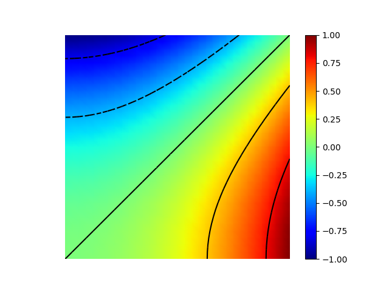
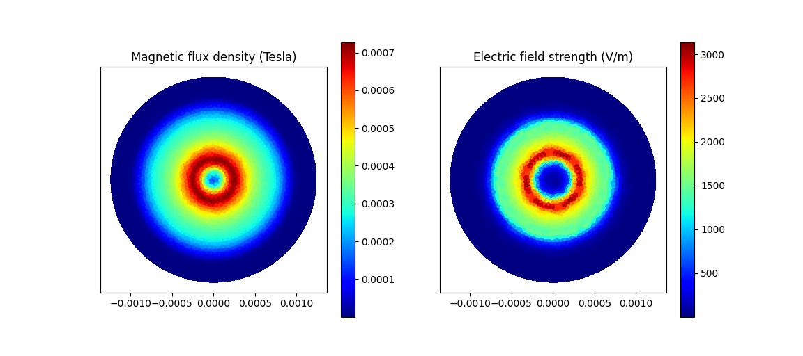

```bash
git clone https://github.com/kinnala/scikit-fem.git
```

## Peformace Test

|     | Degrees-of-freedom | Assembly (s) | Linear solve (s) |
| --- | ------------------ | ------------ | ---------------- |
| 6   | 64                 | 0.00379      | 0.00163          |
| 7   | 125                | 0.00316      | 0.00088          |
| 8   | 216                | 0.00338      | 0.00098          |
| 9   | 512                | 0.00559      | 0.00224          |
| 10  | 1000               | 0.01190      | 0.00252          |
| 11  | 1728               | 0.02005      | 0.00499          |
| 12  | 4096               | 0.05591      | 0.03110          |
| 13  | 8000               | 0.12090      | 0.10694          |
| 14  | 15625              | 0.29180      | 0.55094          |
| 15  | 32768              | 0.59837      | 3.93674          |
| 16  | 64000              | 1.20961      | 20.77431         |
| 17  | 125000             | 2.83781      | nan              |
| 18  | 262144             | 5.53232      | nan              |
| 19  | 512000             | 10.89911     | nan              |
| 20  | 1030301            | 21.68128     | nan              |

## Gallery

Poisson equation
 Example 1: Poisson equation with unit load
 Example 7: Discontinuous Galerkin method
 Example 12: Postprocessing
 Example 13: Laplace with mixed boundary conditions
 Example 14: Laplace with inhomogeneous boundary conditions
 Example 15: One-dimensional Poisson equation
 Example 9: Three-dimensional Poisson equation (need install pyamg/pyamgcl/vedo)
 Example 22: Adaptive Poisson equation
 Example 37: Mixed Poisson equation
 Example 38: Point source
*Example 40: Hybridizable discontinuous Galerkin method
 Example 41: Mixed meshes

Solid mechanics
 Example 2: Kirchhoff plate bending problem
 Example 3: Linear elastic eigenvalue problem
 Example 4: Linearized contact problem
 Example 8: Argyris basis functions
 Example 11: Three-dimensional linear elasticity
 Example 21: Structural vibration
 Example 34: Euler-Bernoulli beam
 Example 36: Nearly incompressible hyperelasticity
 Example 43: Hyperelasticity (need install vedo)

Fluid mechanics
 Example 18: Stokes equations
 Example 20: Creeping flow via stream-function
 Example 24: Stokes flow with inhomogeneous boundary conditions
 Example 29: Linear hydrodynamic stability
 Example 30: Krylov-Uzawa method for the Stokes equation
 Example 32: Block diagonally preconditioned Stokes solver (need install pyamg/pyamgcl)
 Example 42: Periodic meshes

Heat transfer
 Example 17: Insulated wire
 Example 19: Heat equation
 Example 25: Forced convection
 Example 26: Restricting problem to a subdomain
 Example 28: Conjugate heat transfer
 Example 39: One-dimensional heat equation

Miscellaneous
 Example 10: Nonlinear minimal surface problem
 Example 16: Legendre’s equation
 Example 31: Curved elements
 Example 33: H(curl) conforming model problem
*Example 35: Characteristic impedance and velocity factor (E/H Cal)
 Example 44: Wave equation
*Example 46: Waveguide Cutoff Analysis
 Example 47: Projection between two meshes using supermesh
 Example 48: Solve :math:`\Delta^2 u = 1` using HHJ element.
 Example 47: Projection between two meshes using supermesh (need install shapely)

## Run

|                  |             |                           |                                                                            |
| ---------------- | ----------- | ------------------------- | -------------------------------------------------------------------------- |
| Poisson equation | Example 1:  |  | Poisson equation with unit load                                            |
|                  | Example 7:  |  | Discontinuous Galerkin method                                              |
|                  | Example 12: |  | Postprocessing                                                             |
|                  | Example 13: |  | Laplace with mixed boundary conditions                                     |
|                  | Example 14: |  | Laplace with inhomogeneous boundary conditions                             |
|                  | Example 15: |  | One-dimensional Poisson equation                                           |
|                  | Example 9:  |  | Three-dimensional Poisson equation (need install pyamg/pyamgcl/vedo)       |
|                  | Example 22: |  | Adaptive Poisson equation                                                  |
|                  | Example 37: |  | Mixed Poisson equation                                                     |
|                  | Example 38: |  | Point source                                                               |
|                  | Example 40: |  | Hybridizable discontinuous Galerkin method                                 |
|                  | Example 41: |  | Mixed meshes                                                               |
| Solid mechanics  | Example 2:  |  | Kirchhoff plate bending problem                                            |
|                  | Example 3:  |  | Linear elastic eigenvalue problem                                          |
|                  | Example 4:  |  | Linearized contact problem                                                 |
|                  | Example 8:  |  | Argyris basis functions                                                    |
|                  | Example 11: |  | Three-dimensional linear elasticity                                        |
|                  | Example 21: |  | Structural vibration                                                       |
|                  | Example 34: |  | Euler-Bernoulli beam                                                       |
|                  | Example 36: |  | Nearly incompressible hyperelasticity                                      |
|                  | Example 43: |  | Hyperelasticity (need install vedo)                                        |
| Fluid mechanics  | Example 18: |  | Stokes equations                                                           |
|                  | Example 20: |  | Creeping flow via stream-function                                          |
|                  | Example 24: |  | Stokes flow with inhomogeneous boundary conditions                         |
|                  | Example 29: |  | Linear hydrodynamic stability                                              |
|                  | Example 30: |  | Krylov-Uzawa method for the Stokes equation                                |
|                  | Example 32: |  | Block diagonally preconditioned Stokes solver (need install pyamg/pyamgcl) |
|                  | Example 42: |  | Periodic meshes                                                            |
| Heat transfer    | Example 17: |  | Insulated wire                                                             |
|                  | Example 19: |           | Heat equation                                                              |
|                  | Example 25: |  | Forced convection                                                          |
|                  | Example 26: |  | Restricting problem to a subdomain                                         |
|                  | Example 28: |           | Conjugate heat transfer                                                    |
|                  | Example 39: |           | One-dimensional heat equation                                              |
| Miscellaneous    | Example 10: |  | Nonlinear minimal surface problem                                          |
|                  | Example 16: |  | Legendre’s equation                                                        |
|                  | Example 31: |  | Curved elements                                                            |
|                  | Example 33: |  | H(curl) conforming model problem                                           |
|                  | Example 35: |  | Characteristic impedance and velocity factor (E/H Cal)                     |
|                  | Example 44: |  | Wave equation                                                              |
|                  | Example 46: |  | Waveguide Cutoff Analysis                                                  |
|                  | Example 47: |  | Projection between two meshes using supermesh                              |
|                  | Example 48: |  | Solve :math:`\Delta^2 u = 1` using HHJ element.                            |
|                  | Example 47: |  | Projection between two meshes using supermesh (need install shapely)       |
